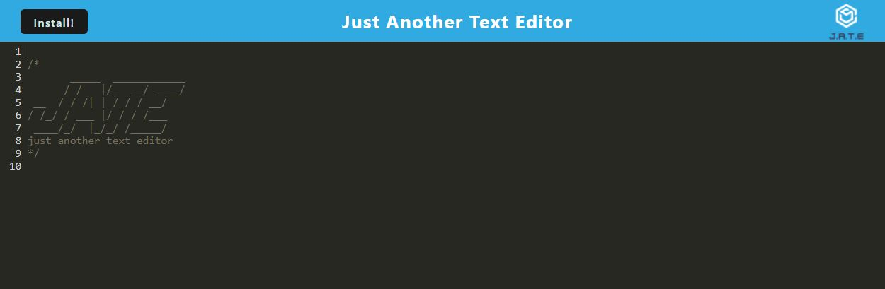

# ZW-PWA-TEXT-EDITOR
Just another text editor using PWA

## **Table of Contents**

* [Description](#description)

* [Installation](#installation)

* [Usage Instructions](#usage)

* [Technologies](#technologies)

* [Questions](#questions)

## **Description**

The ZW-PWA-TEXT-EDITOR is just another text editor (J.A.T.E) program that allows a user to store notes in local storage online or offline using a locally installed version of the program 

VISIT THE DEPLOYED APPLICATION HERE: [J.A.T.E](https://zw-pwa-text-editor.herokuapp.com/)

## **Installation**

There are three options for installing and/or accessing this application on your local machine: 

* Option 1: Clone this repository to your local machine and open it with your preferred code editor. Open the terminal on the local file and run 'npm install' to install all dependencies to your machine. To start the program you can consult the package.json for run commands or enter 'npm start' into the terminal. Open http://localhost/3000 in your browser once the server is listening.

*Option 2: Follow the link above to the deployed site and click the install button on the upper left hand side of the page to install to your local machine.

*Option 3: Follow the link to the deployed site and enter your text in the main screen there

## **Usage Instructions**

Enter your text into the J.A.T.E. Anything you enter will persist even if you close the application and open it again! Enjoy. 

## **Technologies**

* [JavaScript](https://www.javascript.com/) 
* [Node](https://nodejs.org/en/) 
* [NPM](https://www.npmjs.com/) 
* [Heroku](https://www.heroku.com/) 

## **Questions**

Please contact the author with questions through Github or the email contact provided below:

* [Github](https://www.github.com/ZacharyWarnes)
* [email](mailto:zacharywarnes@gmail.com)

